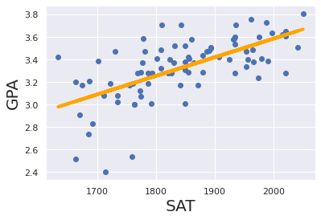
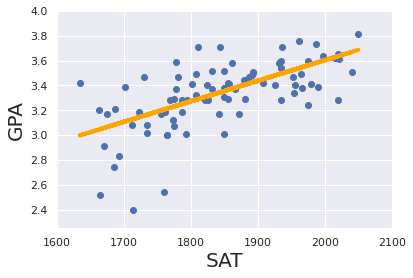

```python
# This Python 3 environment comes with many helpful analytics libraries installed
# It is defined by the kaggle/python Docker image: https://github.com/kaggle/docker-python
# For example, here's several helpful packages to load

import numpy as np # linear algebra
import pandas as pd # data processing, CSV file I/O (e.g. pd.read_csv)

# Input data files are available in the read-only "../input/" directory
# For example, running this (by clicking run or pressing Shift+Enter) will list all files under the input directory

import os
for dirname, _, filenames in os.walk('/kaggle/input'):
    for filename in filenames:
        print(os.path.join(dirname, filename))

# You can write up to 5GB to the current directory (/kaggle/working/) that gets preserved as output when you create a version using "Save & Run All" 
# You can also write temporary files to /kaggle/temp/, but they won't be saved outside of the current session
```

    /kaggle/input/101-simple-linear-regressioncsv/1.01. Simple linear regression.csv
    /kaggle/input/102-multiple-linear-regression/1.02 Multiple linear regression.csv
    


```python
import matplotlib.pyplot as plt
import seaborn as sns
sns.set()

from sklearn.linear_model import LinearRegression
```

# Simple Linear Regression


```python
data = pd.read_csv('../input/101-simple-linear-regressioncsv/1.01. Simple linear regression.csv')
data.head()
```


<div>
<style scoped>
    .dataframe tbody tr th:only-of-type {
        vertical-align: middle;
    }

    .dataframe tbody tr th {
        vertical-align: top;
    }

    .dataframe thead th {
        text-align: right;
    }
</style>
<table border="1" class="dataframe">
  <thead>
    <tr style="text-align: right;">
      <th></th>
      <th>SAT</th>
      <th>GPA</th>
    </tr>
  </thead>
  <tbody>
    <tr>
      <th>0</th>
      <td>1714</td>
      <td>2.40</td>
    </tr>
    <tr>
      <th>1</th>
      <td>1664</td>
      <td>2.52</td>
    </tr>
    <tr>
      <th>2</th>
      <td>1760</td>
      <td>2.54</td>
    </tr>
    <tr>
      <th>3</th>
      <td>1685</td>
      <td>2.74</td>
    </tr>
    <tr>
      <th>4</th>
      <td>1693</td>
      <td>2.83</td>
    </tr>
  </tbody>
</table>
</div>


```python
# feature
x = data['SAT']

# target
y = data['GPA']
```


```python
x_matrix = x.values.reshape(-1, 1)
reg = LinearRegression()
reg.fit(x_matrix, y)
```


    LinearRegression()


```python
# R-squared
display(reg.score(x_matrix, y))

# coefficiants
display(reg.coef_)

# intercept
display(reg.intercept_)
```


    0.40600391479679765


    array([0.00165569])


    0.2750402996602803


```python
new_data = pd.DataFrame(data = [1730, 1750], columns = ['SAT'])
reg.predict(new_data)
```


    array([3.13938063, 3.17249439])


```python
new_data['Predicated_GPA'] = reg.predict(new_data)
new_data
```


<div>
<style scoped>
    .dataframe tbody tr th:only-of-type {
        vertical-align: middle;
    }

    .dataframe tbody tr th {
        vertical-align: top;
    }

    .dataframe thead th {
        text-align: right;
    }
</style>
<table border="1" class="dataframe">
  <thead>
    <tr style="text-align: right;">
      <th></th>
      <th>SAT</th>
      <th>Predicated_GPA</th>
    </tr>
  </thead>
  <tbody>
    <tr>
      <th>0</th>
      <td>1730</td>
      <td>3.139381</td>
    </tr>
    <tr>
      <th>1</th>
      <td>1750</td>
      <td>3.172494</td>
    </tr>
  </tbody>
</table>
</div>


```python
plt.scatter(x, y)
yhat = reg.coef_ * x_matrix + reg.intercept_

fig = plt.plot(x, yhat, lw = 4, c = 'orange', label = 'Regression Line')
plt.xlabel('SAT', fontsize = 20)
plt.ylabel('GPA', fontsize = 20)
plt.show()
```





# Multiple Linear Regression


```python
data = pd.read_csv('../input/102-multiple-linear-regression/1.02 Multiple linear regression.csv')
data.head()
```


<div>
<style scoped>
    .dataframe tbody tr th:only-of-type {
        vertical-align: middle;
    }

    .dataframe tbody tr th {
        vertical-align: top;
    }

    .dataframe thead th {
        text-align: right;
    }
</style>
<table border="1" class="dataframe">
  <thead>
    <tr style="text-align: right;">
      <th></th>
      <th>SAT</th>
      <th>Rand 1,2,3</th>
      <th>GPA</th>
    </tr>
  </thead>
  <tbody>
    <tr>
      <th>0</th>
      <td>1714</td>
      <td>1</td>
      <td>2.40</td>
    </tr>
    <tr>
      <th>1</th>
      <td>1664</td>
      <td>3</td>
      <td>2.52</td>
    </tr>
    <tr>
      <th>2</th>
      <td>1760</td>
      <td>3</td>
      <td>2.54</td>
    </tr>
    <tr>
      <th>3</th>
      <td>1685</td>
      <td>3</td>
      <td>2.74</td>
    </tr>
    <tr>
      <th>4</th>
      <td>1693</td>
      <td>2</td>
      <td>2.83</td>
    </tr>
  </tbody>
</table>
</div>


```python
data.describe()
```


<div>
<style scoped>
    .dataframe tbody tr th:only-of-type {
        vertical-align: middle;
    }

    .dataframe tbody tr th {
        vertical-align: top;
    }

    .dataframe thead th {
        text-align: right;
    }
</style>
<table border="1" class="dataframe">
  <thead>
    <tr style="text-align: right;">
      <th></th>
      <th>SAT</th>
      <th>Rand 1,2,3</th>
      <th>GPA</th>
    </tr>
  </thead>
  <tbody>
    <tr>
      <th>count</th>
      <td>84.000000</td>
      <td>84.000000</td>
      <td>84.000000</td>
    </tr>
    <tr>
      <th>mean</th>
      <td>1845.273810</td>
      <td>2.059524</td>
      <td>3.330238</td>
    </tr>
    <tr>
      <th>std</th>
      <td>104.530661</td>
      <td>0.855192</td>
      <td>0.271617</td>
    </tr>
    <tr>
      <th>min</th>
      <td>1634.000000</td>
      <td>1.000000</td>
      <td>2.400000</td>
    </tr>
    <tr>
      <th>25%</th>
      <td>1772.000000</td>
      <td>1.000000</td>
      <td>3.190000</td>
    </tr>
    <tr>
      <th>50%</th>
      <td>1846.000000</td>
      <td>2.000000</td>
      <td>3.380000</td>
    </tr>
    <tr>
      <th>75%</th>
      <td>1934.000000</td>
      <td>3.000000</td>
      <td>3.502500</td>
    </tr>
    <tr>
      <th>max</th>
      <td>2050.000000</td>
      <td>3.000000</td>
      <td>3.810000</td>
    </tr>
  </tbody>
</table>
</div>


```python
x = data[['SAT', 'Rand 1,2,3']]
y = data['GPA']
```


```python
reg.fit(x, y)

# R-squared
r2 = reg.score(x, y)
display(reg.score(x, y))

# coefficiants
display(reg.coef_)

# intercept
display(reg.intercept_)
```


    0.40668119528142843


    array([ 0.00165354, -0.00826982])


    0.29603261264909486


```python
n = x.shape[0]
p = x.shape[1]

adjusted_r2 = 1 - (1 - r2) * (n - 1) / (n - p - 1)
adjusted_r2
```


    0.39203134825134023


```python
from sklearn.feature_selection import f_regression
```


```python
p_values = f_regression(x, y)[1]
p_values.round(3)
```


    array([0.   , 0.676])


```python
reg_summary = pd.DataFrame(data = x.columns.values, columns = ['Features'])
reg_summary['Coefficiants'] = reg.coef_
reg_summary['P-values'] = p_values.round(3)

reg_summary
```


<div>
<style scoped>
    .dataframe tbody tr th:only-of-type {
        vertical-align: middle;
    }

    .dataframe tbody tr th {
        vertical-align: top;
    }

    .dataframe thead th {
        text-align: right;
    }
</style>
<table border="1" class="dataframe">
  <thead>
    <tr style="text-align: right;">
      <th></th>
      <th>Features</th>
      <th>Coefficiants</th>
      <th>P-values</th>
    </tr>
  </thead>
  <tbody>
    <tr>
      <th>0</th>
      <td>SAT</td>
      <td>0.001654</td>
      <td>0.000</td>
    </tr>
    <tr>
      <th>1</th>
      <td>Rand 1,2,3</td>
      <td>-0.008270</td>
      <td>0.676</td>
    </tr>
  </tbody>
</table>
</div>


```python
plt.scatter(x['SAT'], y)
yhat = reg.coef_ * x + reg.intercept_

fig = plt.plot(x, yhat, lw = 4, c = 'orange', label = 'Regression Line')
plt.xlabel('SAT', fontsize = 20)
plt.ylabel('GPA', fontsize = 20)
plt.ylim(2.25,4)
plt.xlim(1600, 2100)
plt.show()
```





# Multiple Linear Regression with standardization


```python
from sklearn.preprocessing import StandardScaler
```


```python
scaler = StandardScaler()
scaler.fit(x)
```


    StandardScaler()


```python
x_scaled = scaler.transform(x)

reg = LinearRegression()
reg.fit(x_scaled, y)
```


    LinearRegression()


```python
reg.coef_, reg.intercept_
```


    (array([ 0.17181389, -0.00703007]), 3.330238095238095)


```python
reg_summary = pd.DataFrame([['Bias'], ['SAT'], ['Rand 1,2,3']], columns = ['Features'])
reg_summary['Weights'] = reg.intercept_, reg.coef_[0], reg.coef_[1]

reg_summary
```


<div>
<style scoped>
    .dataframe tbody tr th:only-of-type {
        vertical-align: middle;
    }

    .dataframe tbody tr th {
        vertical-align: top;
    }

    .dataframe thead th {
        text-align: right;
    }
</style>
<table border="1" class="dataframe">
  <thead>
    <tr style="text-align: right;">
      <th></th>
      <th>Features</th>
      <th>Weights</th>
    </tr>
  </thead>
  <tbody>
    <tr>
      <th>0</th>
      <td>Bias</td>
      <td>3.330238</td>
    </tr>
    <tr>
      <th>1</th>
      <td>SAT</td>
      <td>0.171814</td>
    </tr>
    <tr>
      <th>2</th>
      <td>Rand 1,2,3</td>
      <td>-0.007030</td>
    </tr>
  </tbody>
</table>
</div>


### Making predictions with standardized coefficiants


```python
new_data = pd.DataFrame([[1700, 2], [1750, 3]], columns = ['SAT', 'Rand 1,2,3'])
new_data
```


<div>
<style scoped>
    .dataframe tbody tr th:only-of-type {
        vertical-align: middle;
    }

    .dataframe tbody tr th {
        vertical-align: top;
    }

    .dataframe thead th {
        text-align: right;
    }
</style>
<table border="1" class="dataframe">
  <thead>
    <tr style="text-align: right;">
      <th></th>
      <th>SAT</th>
      <th>Rand 1,2,3</th>
    </tr>
  </thead>
  <tbody>
    <tr>
      <th>0</th>
      <td>1700</td>
      <td>2</td>
    </tr>
    <tr>
      <th>1</th>
      <td>1750</td>
      <td>3</td>
    </tr>
  </tbody>
</table>
</div>


```python
new_scaled_data = scaler.transform(new_data)
reg.predict(new_scaled_data)
```


    array([3.09051403, 3.1649213 ])


```python
reg_simple = LinearRegression()
x_simple_matrix = x_scaled[:,0].reshape(-1, 1)
reg_simple.fit(x_simple_matrix, y)
```


    LinearRegression()


```python
reg_simple.predict(new_scaled_data[:,0].reshape(-1, 1))
```


    array([3.08970998, 3.17249439])


